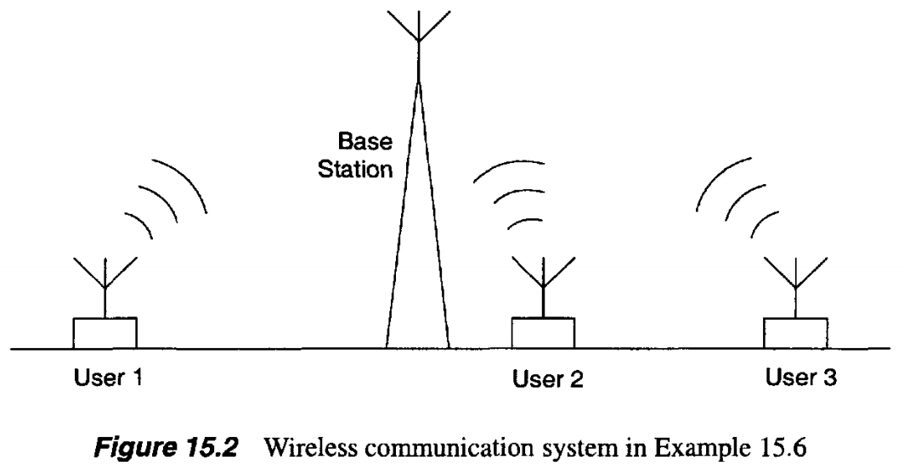
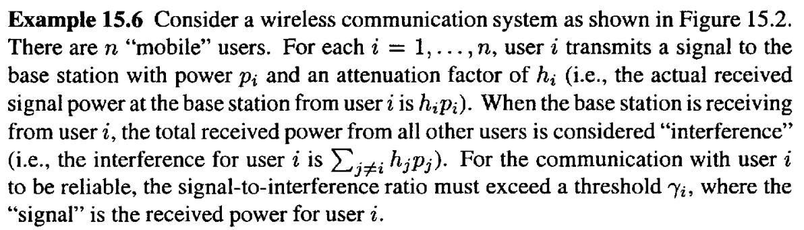
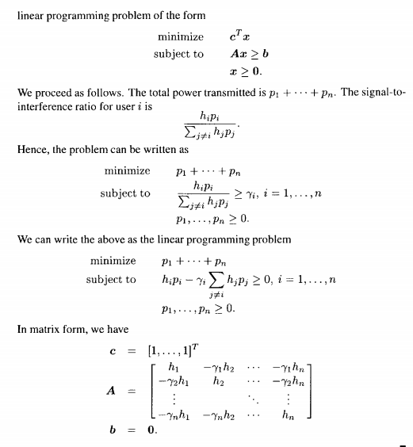

# Linear Optimization in Wireless Communication (Interference / SINR) — MATLAB Example

An illustrative example is provided for modeling an interference-limited wireless uplink and reformulating **SINR (Signal-to-Interference Ratio)** constraints as a **linear optimization problem**.

A MATLAB script is included to construct the standard linear-program form:

**minimize** `C' * p`  
**subject to** `A * p <= b`

where `p` is the transmit-power vector, and the SINR feasibility conditions are encoded inside `A` and `b`.

---

## Repository Contents

- `Wireless_Communication_Linear_Optimization.m`  
  MATLAB implementation where SINR constraints and the corresponding LP matrices are derived.

- `Screenshot_1.png`, `Screenshot_2.png`  
  Problem statement and intermediate formulation.

- `Screenshot_3.png`  
  Final checked formulation/solution snapshot.

---

## Problem Statement (Interference-Limited Uplink)

A system with **n** mobile users and one base station is considered.

For each user `i ∈ {1,...,n}`:

- Transmit power is denoted by `p_i`.
- Channel attenuation (gain) is denoted by `h_i`.
- Received signal power for user `i` is:

  `S_i = h_i * p_i`

- When the base station decodes user `i`, the received power from all other users is treated as interference:

  `I_i = sum_{j != i} (h_j * p_j)`

- Reliable communication is enforced by requiring SINR to exceed a threshold `gamma_i`:

  `SINR_i = (h_i * p_i) / (sum_{j != i} (h_j * p_j)) >= gamma_i`

---

## SINR → Linear Inequalities

Each SINR constraint is rearranged into a linear inequality.

Starting from:

`(h_i * p_i) / (sum_{j != i} (h_j * p_j)) >= gamma_i`

Multiply both sides by the denominator:

`h_i * p_i >= gamma_i * sum_{j != i} (h_j * p_j)`

Move everything to one side:

`h_i * p_i - gamma_i * sum_{j != i} (h_j * p_j) >= 0`

To match the common LP form `A * p <= b`, the equivalent inequality is written as:

`-h_i * p_i + gamma_i * sum_{j != i} (h_j * p_j) <= 0`

By stacking these inequalities for all users `i = 1..n`, the matrices `A` and `b` are obtained.

---

## MATLAB Implementation Notes

- Symbolic variables (`syms`) are used for derivations and matrix construction.
- `linprog` is intentionally not used, since derivation is performed symbolically and the LP form is built manually for clarity and inspection.

---

## How the Script Is Used

### Input
- `n`: the number of users (requested at runtime)

### Output
The script prints/produces:
- The SINR formulation and its constraint form
- The standard LP components:
  - `C'` (objective coefficients, as defined in the script)
  - `A` (constraint matrix)
  - `b` (constraint vector)

---

## Screenshots (Embedded)

  
  

---

## Quick Start

1. MATLAB (with Symbolic Math Toolbox) is recommended.
2. Run:
   - `Wireless_Communication_Linear_Optimization.m`
3. Enter `n` when prompted.
4. Inspect the generated SINR formulation and the LP matrices `C'`, `A`, and `b` in the MATLAB output.

---

## Notes

- The exact objective (i.e., how `C'` is defined) is controlled inside the MATLAB script and is expected to reflect the intended optimization target (e.g., a power-related criterion).
- Parameter values (e.g., `h_i`, `gamma_i`) are expected to be set/edited inside the script to match the desired scenario.

---
